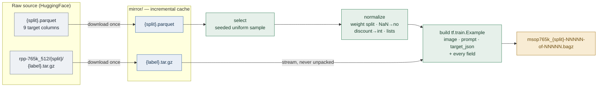
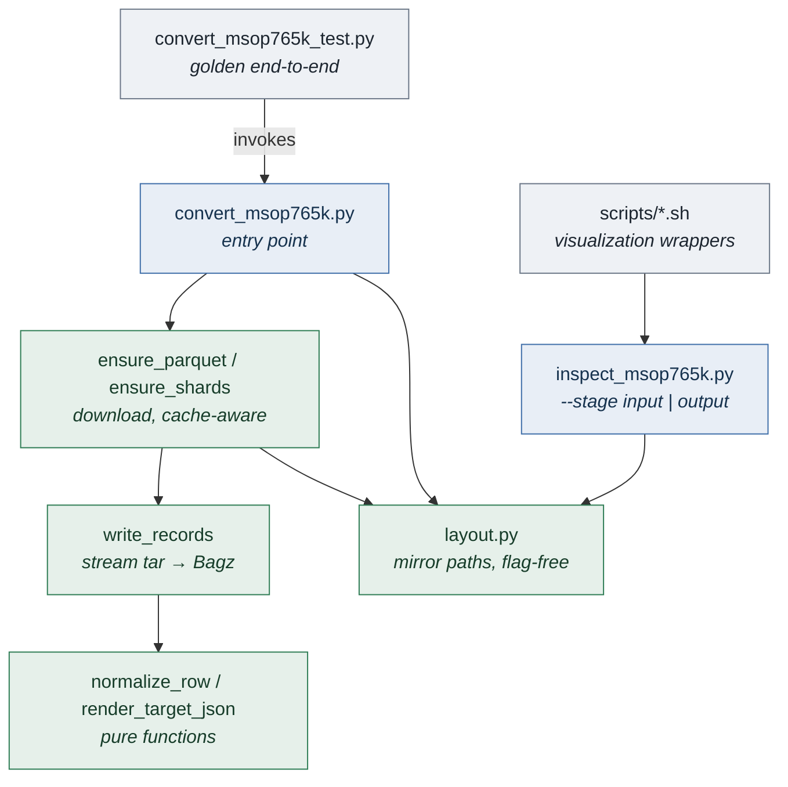

# mSOP-765k pipeline — requirements and design

What this directory is for, what it must satisfy, and how it is built. Read this
first; `decisions_made.md` records why individual choices were made, and
`testing.md` covers the tests.

## Context

[mSOP-765k](https://www.msop-765k.org/) (Lamm & Keuper, TMLR 01/2026) is 765,463
images cropped from European retail advertisement leaflets, each annotated with
the advertised product's structured details. The goal here is to turn it into
SFT data for a vision-language model, and to evaluate that model against the
paper's zero-shot baselines (its Tables 4 and 5).

Scope is **offline data preparation only**. Training, the online preprocessor
that feeds the model, and the evaluation metrics all live elsewhere.

## Requirements

### Functional

| # | Requirement |
|---|---|
| R1 | **Input is the raw source, untransformed.** The per-split parquet and the per-label `.tar.gz` image shards exactly as published. |
| R2 | **Output is Bagz files of `tf.train.Example`.** One set per split, so two in total: train and test. |
| R3 | **Every record carries a VQA triple.** At minimum one feature holding the visual input, one holding the question, and one holding the answer — `image/encoded`, `prompt`, `target_json`. |
| R4 | **The answer covers the paper's zero-shot targets.** The seven scored in Tables 4 and 5, so results are comparable. `product_category` and `GTINs` are excluded: neither appears in the image. |
| R5 | **Records stay re-derivable.** Every source field is kept per-feature, so a different prompt or answer can be rebuilt online without re-running the pipeline. |
| R6 | **Scale is a parameter, not a code path.** A 200-record sample and the full 765k split differ only by `--max_records`. |
| R7 | **Both ends are inspectable.** Input and output can be rendered to HTML to see what the conversion did. |

### Non-functional

| # | Requirement |
|---|---|
| N1 | **Re-runnable offline.** Fetching is separate from converting; the mirror is an incremental cache, so a re-run costs no downloads. |
| N2 | **Reproducible.** Converting the same mirror twice produces identical files. |
| N3 | **Bounded memory.** 765k records and ~73 GB of images must stream, never accumulate. |
| N4 | **Regression-guarded.** An end-to-end test pins the output against a reviewed golden. |

## Design

### Data transformation

One source row becomes one record. `product_weight` splits into
`weight_number` + `weight_unit`, so the parquet's 9 target columns become 10
feature keys, of which 8 form the answer.

### Components

`layout.py` exists because both the converter and the viewer need the mirror's
path scheme, and importing a flag-defining module into another raises
`DuplicateFlagError`.

### Record schema

| Feature | Role | Content |
|---|---|---|
| `image/encoded` | **VQA visual input** | JPEG bytes, 512px longest edge |
| `image/format` | | `jpeg` |
| `prompt` | **VQA question** | the paper's instruction, stored per record |
| `prompt_system` | | the paper's system message |
| `target_json` | **VQA answer** | JSON of the 8 answer keys |
| `id`, `product_id`, `filename` | provenance | `10000/119.jpg`, its label, its file |
| `brand` … `absolute_discount` | re-derivation | all 10 fields, normalized, one per feature |

All values are bytes, matching the `convert_sudoku.py` precedent so the output
loads through the repo's existing `PicklableBagzReader`.

## Deliberate non-goals

* No training, no online preprocessing, no metric implementation.
* No 256px variant: 512 is the largest the dataset publishes.
* No `--target_view` flag; the grounded answer is the only output, since a
  different view is rebuildable from the retained per-field features.
* No network in tests.
