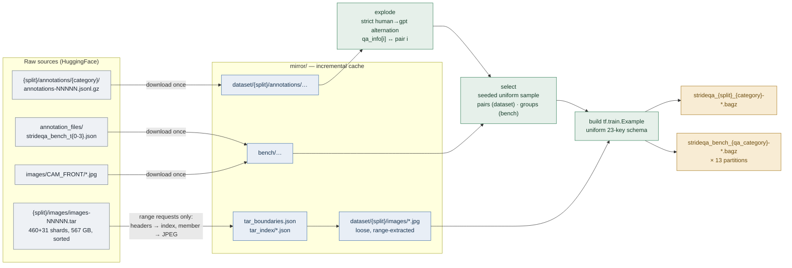
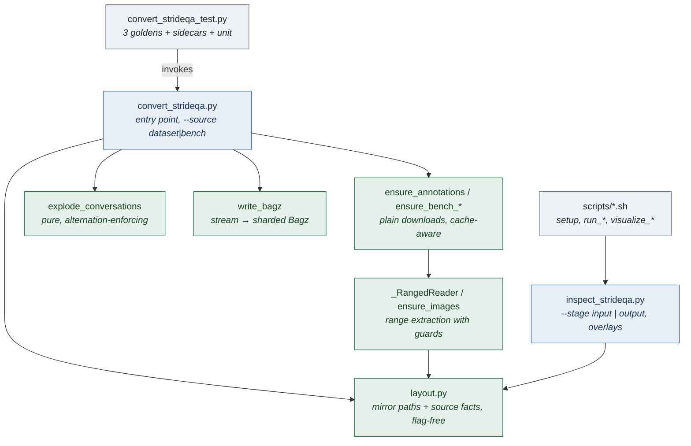

# STRIDE-QA pipeline — requirements and design

What this directory is for, what it must satisfy, and how it is built. Read
this first; `decisions_made.md` records why individual choices were made, and
`testing.md` covers the tests.

## Context

[STRIDE-QA](https://arxiv.org/abs/2508.10427) (Turing Motors) is a
spatiotemporal question-answering corpus for urban driving, in two
HuggingFace repositories (both CC BY-NC-SA 4.0):

* **`turing-motors/STRIDE-QA-Dataset`** — ~491k samples (~460k train /
  ~31k val), ~16.4M QA pairs over 2880×1860 camera frames, in three
  categories: `ego_centric_spatial_qa`, `ego_centric_spatiotemporal_qa`
  (4 frames per sample), `object_centric_spatial_qa`. **567 GB**, images in
  ~1.1 GB tar shards.
* **`turing-motors/STRIDE-QA-Bench`** — 409 scene groups × 13 questions =
  5,317 records over 4-frame sequences, asking for distance, direction, ego
  speed and target speed at horizons t0..t3 (t0 = now, tN = N seconds ahead).

The goal here is SFT data for a vision-language model and an offline copy of
the benchmark it will be scored on. Scope is **offline data preparation
only**: training, the online preprocessor, and metric implementations live
elsewhere.

## Requirements

### Functional

| # | Requirement |
|---|---|
| R1 | **Input is the raw source, untransformed.** Annotation shards and images exactly as published, from both repositories, through one pipeline (`--source dataset\|bench`). |
| R2 | **Output is Bagz files of all-bytes `tf.train.Example`**, usable as training or test sets. Dataset: one spec per (split, category). Bench: one run writes 13 specs partitioned by `qa_category`, plus a single sidecar. |
| R3 | **One record per QA pair**, both sources. Every record is a self-contained VQA triple: `image/encoded` (1 or 4 JPEGs), `prompt`, `target_text`, stored verbatim. |
| R4 | **Records stay re-derivable and joinable.** Sample-level annotations (`bbox`/`rle`/`region`, image/token info) ride along verbatim; bench records keep `group_id`/`horizon`/`gt_value_json`/`unit_json` so the composite metrics can be joined offline. |
| R5 | **Scale is a parameter, not a code path.** `--max_records` counts QA-pair records (dataset) or scene groups (bench); -1 converts everything mirrored. |
| R6 | **Both ends are inspectable.** Input and output render to HTML with region overlays, so what the conversion did can be seen, not inferred. |

### Non-functional

| # | Requirement |
|---|---|
| N1 | **The 567 GB source is never downloaded.** There is *no whole-image-tar code path at all*; single images are extracted with HTTP range requests against the sorted remote tars. Cost tracks records selected. |
| N2 | **Re-runnable offline.** The mirror is an incremental cache (annotations, loose extracted JPEGs, tar indices); a re-run costs no downloads. |
| N3 | **Reproducible.** Converting the same mirror twice produces identical files (deterministic proto serialization, seeded sampling). |
| N4 | **Bounded memory.** Annotation shards stream in three passes; images are fetched per member and never accumulate in memory. |
| N5 | **Regression-guarded.** Golden end-to-end tests pin the output of all three run shapes against reviewed goldens. |
| N6 | **Verified at toy scale only, O(10) examples.** Full-scale conversion is designed for but deliberately not exercised here. |

## Design

### Data transformation

### Range extraction (the no-download constraint)

The Dataset's image tars are plain uncompressed tar, and their members are
lexicographically sorted by filename **across** shards (verified against the
source). That makes single-member extraction cheap:

1. **Boundary map** (`tar_boundaries.json`): one ~4 KB probe per shard reads
   the first member's name. Binary search then maps any filename to its
   shard. Built once per split, cached.
2. **Member index** (`tar_index/images-NNNNN.json`): walking a shard's tar
   headers — one 512-byte range request per member over kept-alive
   connections — yields every member's data offset and size. Built once per
   shard touched, cached.
3. **Member fetch**: one range request covering the member's header block
   plus its data.

Guards on every fetch: the response must be **206** (a 200 body would be the
whole tar — it is never read), Content-Length must equal the requested
length, the tar header must carry the `ustar` magic, the member name must
equal the requested filename, and the bytes must decode as JPEG. Pax headers
(typeflag `x`/`g`, `././@PaxHeader`) are metadata and are skipped in every
walk.

HuggingFace `resolve` URLs redirect to a signed CDN URL. Resolved *without*
a Range header, the signature accepts arbitrary ranges, so one origin
request serves a whole header walk; every read is then a ranged GET on a
kept-alive CDN connection. Rate-limit responses (429) are waited out with
backoff, interrupted walks resume from a checkpoint, and setting `HF_TOKEN`
raises the anonymous limit.

### Components

`layout.py` exists because both the converter and the viewer need the
mirror's path scheme, and importing a flag-defining module into another
raises `DuplicateFlagError`.

### Record schema

All values are bytes (matching the mSOP-765k / `convert_sudoku.py`
precedent); the key set is **uniform across both sources**, with empty bytes
where a feature does not apply. Structured source values ride along as
verbatim JSON — no renumbering, no subsetting.

| Feature | Dataset (per QA pair) | Bench (per question) |
|---|---|---|
| `id` | `{sample_id}/{pair_index:02d}` | `question_id` |
| `image/encoded` | 1 JPEG (spatial) or 4 (spatiotemporal; source order, current **last**) | 4 JPEGs, source order, current **last** |
| `image/filenames_json` | JSON list of source filenames | JSON list (repo-relative paths) |
| `image/format` | `jpeg` | `jpeg` |
| `prompt` | human turn, verbatim | `question`, verbatim |
| `target_text` | gpt turn, verbatim | `gt`, verbatim |
| `qa_category` | `qa_info[i].category` | bench `qa_category` |
| `qa_info_json` | the pair's `qa_info[i]` entry | ∅ |
| `gt_value_json` / `unit_json` | ∅ | numeric ground truth / units |
| `group_id` / `horizon` | ∅ | scene group; derived `t0`..`t3` |
| `region_id` / `object_class` | ∅ | bench fields |
| `bbox_json` / `rle_json` / `region_json` | sample-level, verbatim | ∅ / per-frame RLE dict / ∅ |
| `image_info_json` / `token_info_json` | sample-level, verbatim | ∅ / verbatim |
| `sample_id` / `pair_index` / `category` / `split` | provenance | ∅ |

There is **no `prompt_system` feature**: neither source defines one.

The 4-frame order (`current` last, `images[3] == id`) is verified against
the official bench inference code, which zips `images` with
`["prev_3", "prev_2", "prev_1", "current"]`.

## The bench partitioning: 13 specs, not 1

The four horizon files hold 13 `(horizon, qa_category)` kinds of question.
One conversion run writes one spec per kind, plus a single
`strideqa_bench.metadata.json` listing all 13.

| Aspect | One combined Bagz | 13 partitioned specs (chosen) |
|---|---|---|
| Marginal success rate per category | needs online filtering by `qa_category` | one spec *is* one category: per-type online-eval accuracy curves for free |
| Composite metrics (LSR, TLC, TLC@k, MLSR) | offline join on `group_id`/`horizon` | identical — composites are joins regardless of packaging |
| Bookkeeping | 1 spec | 13 specs + sidecar (13× the file handles) |
| Same-checkpoint discipline | one inference run covers everything | 13 inference runs must all use the same checkpoint before composing |
| Sampling | records | scene groups: any sample covers all partitions, composites stay computable |

The official evaluation loads all horizons into one pool and reports
marginal success rates per quantity × timestep, plus composites that reduce
over a group's full horizon sequence. Records keep `group_id`, `horizon`,
`gt_value_json` and `unit_json` precisely so those joins work offline.

### Quantities × timesteps: 13 categories → 16 metric cells

t0 asks four separate questions; t1..t3 ask three, with distance and
direction **joint** in one question (`ego_distance_data_4d_tN` carries both
quantities despite its name), which the official evaluation scores twice.

| Quantity | t0 | t1 | t2 | t3 |
|---|---|---|---|---|
| Distance | `ego_distance_data` | `ego_distance_data_4d_t1` ┐ | `…_4d_t2` ┐ | `…_4d_t3` ┐ |
| Direction | `target_bearing_angle_data` | `ego_distance_data_4d_t1` ┘ joint | `…_4d_t2` ┘ joint | `…_4d_t3` ┘ joint |
| Ego speed | `ego_speed_data` | `ego_speed_data_4d_t1` | `…_4d_t2` | `…_4d_t3` |
| Target speed | `target_speed_data` | `target_speed_data_4d_t1` | `…_4d_t2` | `…_4d_t3` |

4 + 3×3 = 13 categories filling 16 cells. The composite LSR requires
distance ∧ direction per group and timestep; at t0 it joins two categories,
at t1..t3 both quantities come from the joint question.

## Dataset ↔ Bench category correspondence

Useful when choosing training categories to match benchmark cells. Bench
questions are drawn from the same template pools as Dataset questions where
noted.

| Dataset `qa_info.category` (source category) | Bench `qa_category` | Correspondence |
|---|---|---|
| `target_distance_t0` (spatiotemporal) | `ego_distance_data` | template pools identical, 16/16 |
| `ego_speed_t0` (spatiotemporal) | `ego_speed_data` | same quantity, by construction |
| `target_speed_t0` (spatiotemporal) | `target_speed_data` | same quantity, by construction |
| `target_distance_tN` (spatiotemporal; joint distance+direction despite the name) | `ego_distance_data_4d_tN` | pools overlap partially |
| `ego_speed_tN` (spatiotemporal) | `ego_speed_data_4d_tN` | same quantity, by construction |
| `target_speed_tN` (spatiotemporal) | `target_speed_data_4d_tN` | same quantity, by construction |
| `ego_angle` (**ego-centric spatial**) | `target_bearing_angle_data` | template pools identical, 5/5 (after `Region [k]` normalization) |

The bench t0 bearing question has **no** spatiotemporal Dataset
counterpart: it lives in the ego-centric *spatial* category's angle
questions (`ego_angle`; `ego_clock_position` is the coarse clock-face
variant of the same quantity).

## The VILA conversation convention

Dataset samples store their ~33 QA pairs as one `conversations` list of
alternating `human`/`gpt` turns (VILA convention; roles live only in the
structural `from` field — verified: no `<image>` placeholder or role tags
appear anywhere in the text). Trained as-is, such a sample is one long
sequence with causal attention over the whole conversation and loss on the
gpt turns only — so later questions attend to earlier *answers*. Cross-turn
answer leakage is therefore inherent to the source's intended training
setup, not an artifact.

Exploding to one record per pair (this pipeline) removes both the packing
and the leakage: every record is an independent (image(s), question, answer)
triple. The cost is image duplication — ~28× on Dataset (average pairs per
sample), 13× on Bench (accepted; Bagz stores what it is given).

**TODO (option A):** a future `--granularity sample` could emit one record
per source sample with `conversations_json` verbatim, preserving the VILA
multi-turn packing with no image duplication. Nothing in the current schema
blocks it; the sample-level features are already carried.

## Sampling caveat: train is biased to annotation shard 0

`--annotation_shards N` (default 1) mirrors only the first N annotation
shards of a (split, category) combo, and sampling is uniform **within the
mirrored shards**. Train categories have 4–6 shards, so a default train run
samples only shard 0's records. **Val has exactly one shard per category and
is unbiased.** Bench always fetches all four files. Pass
`--annotation_shards -1` for unbiased train sampling (costs the full
annotation download for that combo, up to ~1 GB; images still track records
selected).

## Deliberate non-goals

* No training, no online preprocessing, no metric implementation. The
  official evaluation (marginals, LSR, TLC/TLC@k/MLSR, Set-of-Marks
  rendering) stays in `turingmotors/STRIDE-QA-Dataset`'s benchmark tree.
* No whole-tar download path, not even as a fallback.
* No image re-encoding: JPEG bytes are stored exactly as published.
* No full-scale run from here: the pipeline is verified at O(10) examples.
